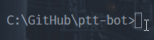
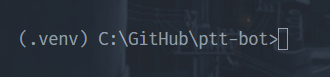
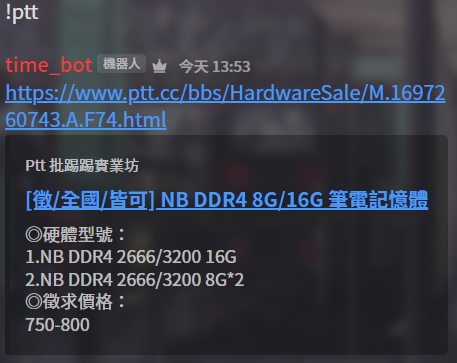

# ptt-bot

 抓取 ptt 上的各種訊息，透過 discord_bot 發送

## 虛擬環境建置

> 請先確定終端機、建置位置是否在本資料夾(ppt-bot)裡


在終端機輸入下面這串指令即可在資料夾裡建置好環境

```bash
python -m venv .venv
```

啟動環境方式

windows

```bash
.venv\Scripts\activate
```

unix/macos

```bash
.venv/bin/activate
```

[環境建置相關文章(vscode in python)](https://code.visualstudio.com/docs/python/environments)

## 相關套件安裝/記錄

> 請先確定安裝前環境是否在虛擬環境(.venv 要存在)裡


### 安裝方式

將所有套件一次安裝

```bash
pip install -r requirements.txt
```

### 記錄已安裝套件

將在虛擬環境上的套件記錄到 requirement.txt 裡

```bash
pip freeze > requirements.txt
```

## 用自己的 discord bot token 啟動

將 settings-example.json 複製成 settings.json

並將裡面的需求填上自己的值，填寫完畢後輸入下面的指令

```bash
py bot.py
```

即可啟動成功

## 使用方式

輸入 **!ptt** 即可獲取最新的貼文

